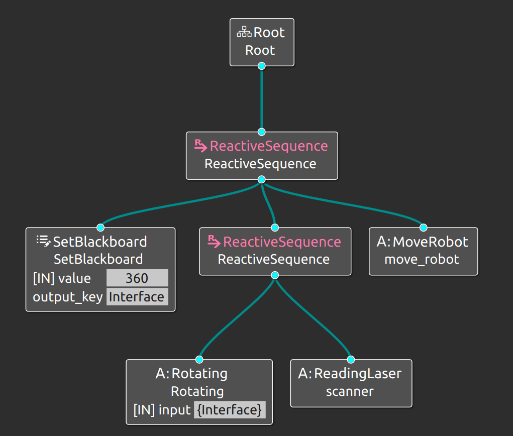
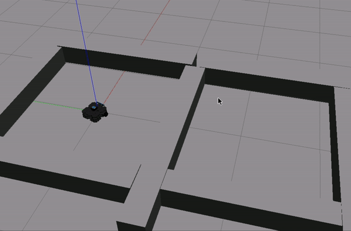
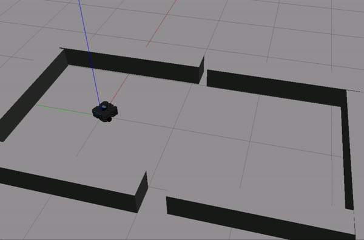
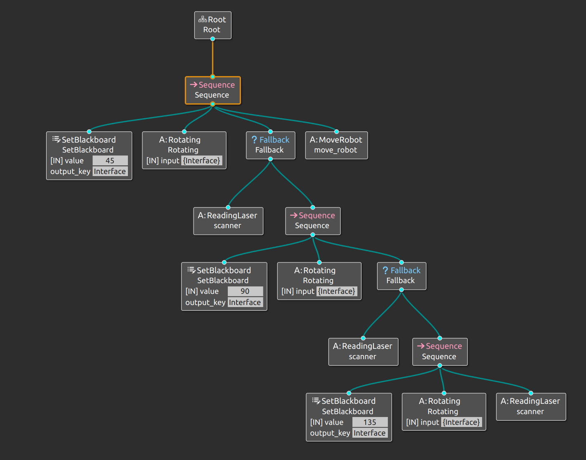
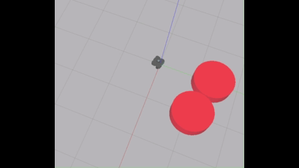
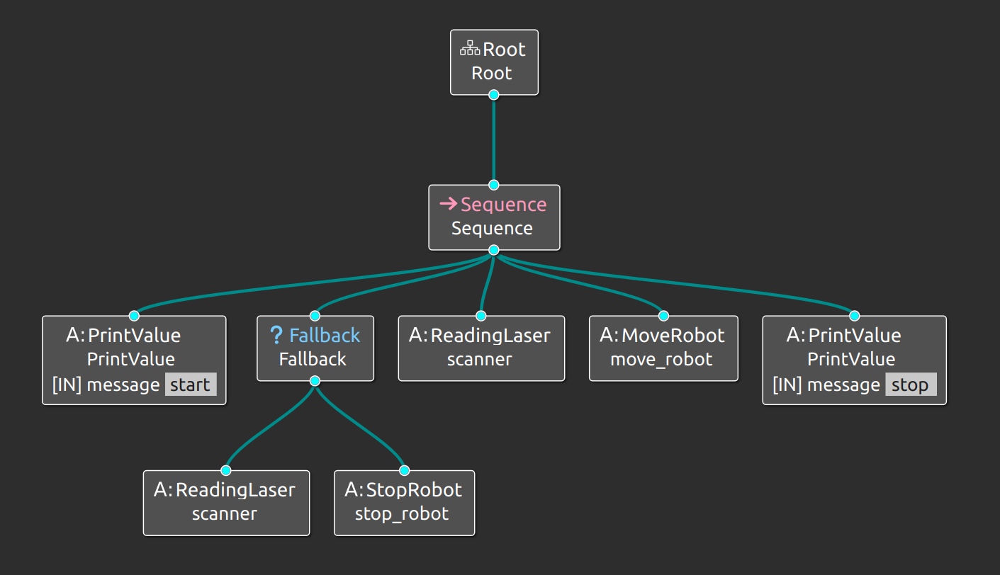
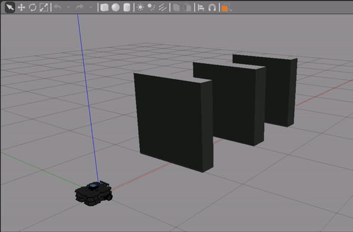

# behavior_trees
Behavior Trees for ROS2 supplemental course from The Construct Sim

## Unit 1: Intro
An introductory Behavior Trees exercise of logic to navigate open areas using laser readings

## Unit 2: create & compile BTs
Exploring Sequential, Fallback, and Auxillary nodes

## Unit 3: Design Principles
Understanding BT Hierarchy, Reactive Actions, Backboards, Subtrees, Decorators, and Logs

